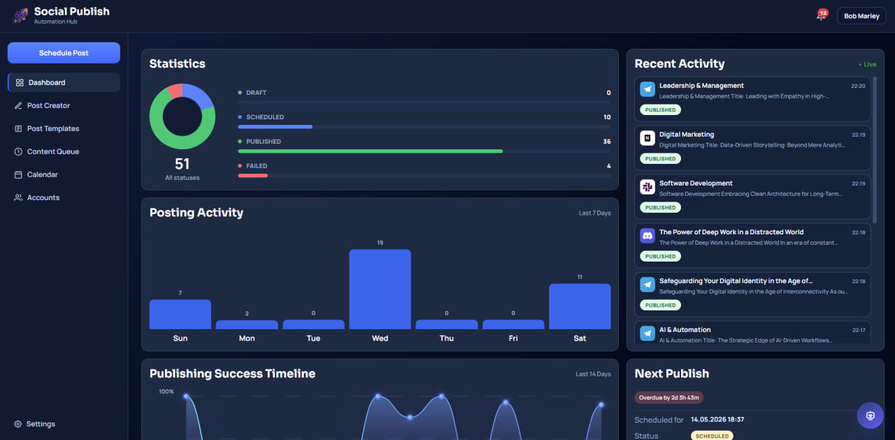
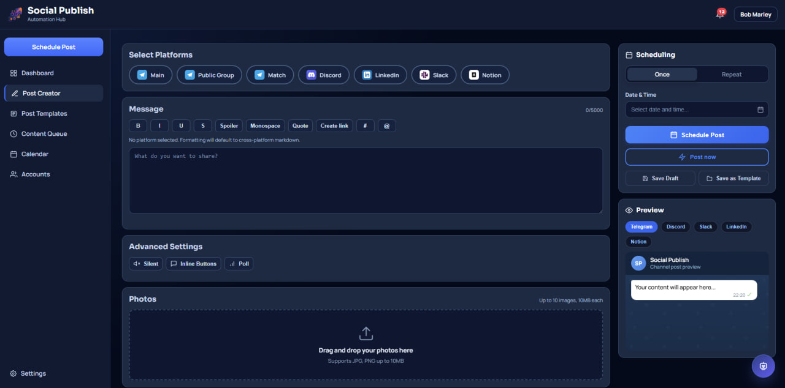
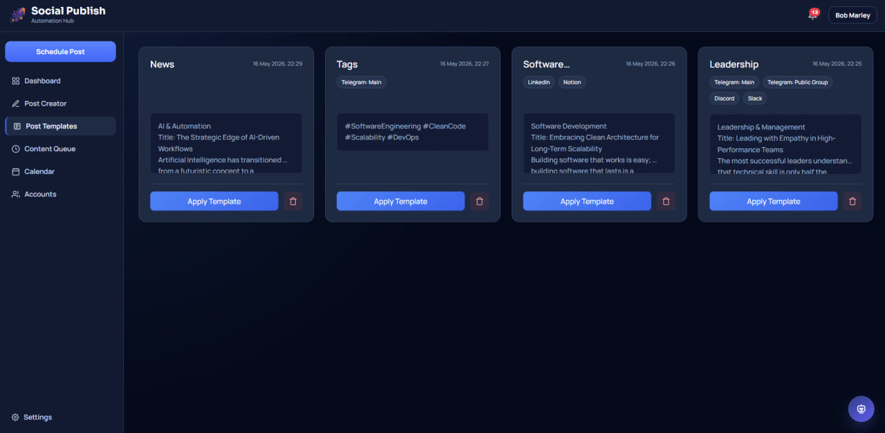
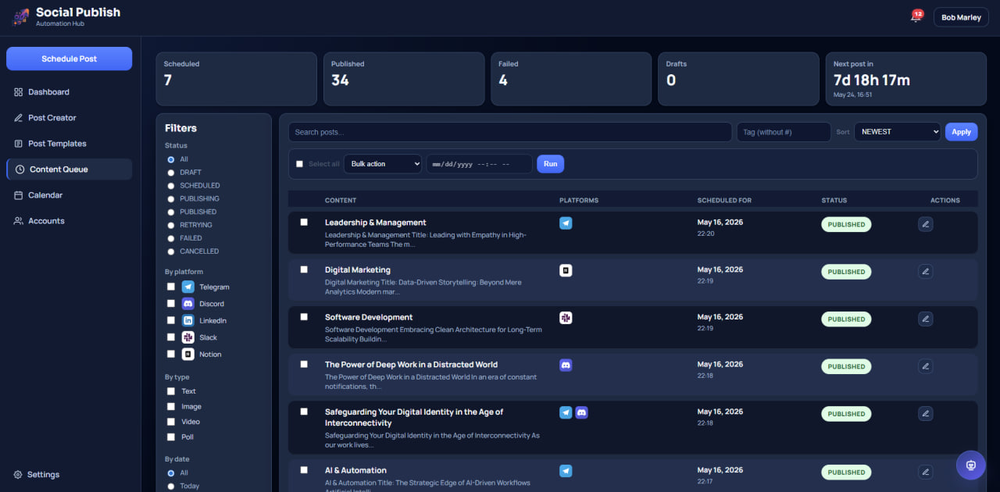
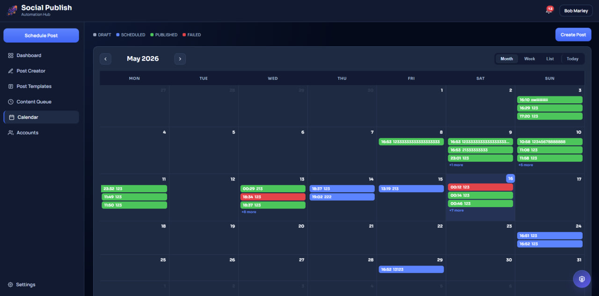
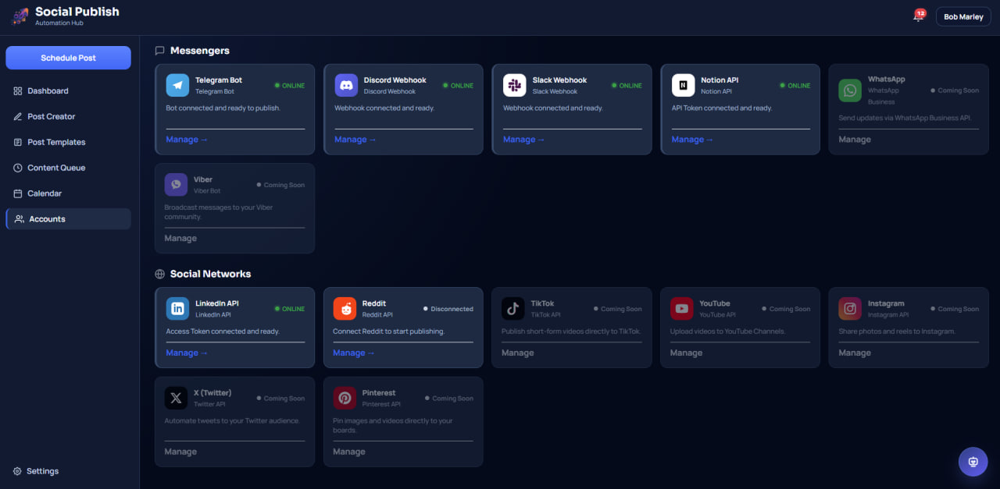
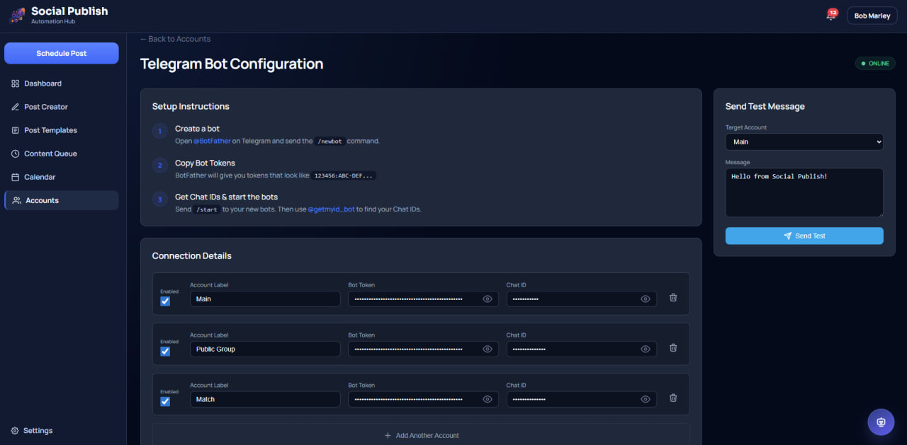
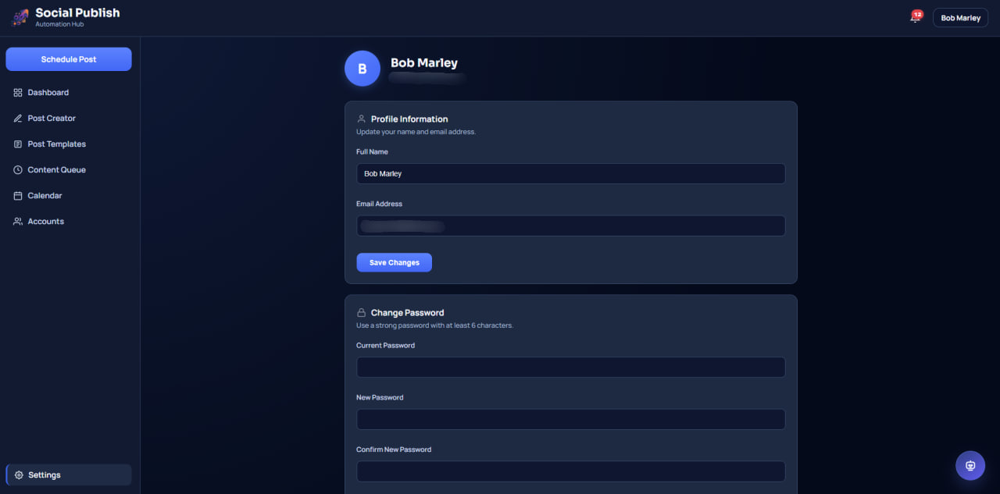

# Social Publish

Social Publish is a professional, scalable multi-platform social media management and automation platform. It allows users to create, schedule, and analyze content across **6 social platforms** simultaneously, leveraging AI capabilities and flexible queue management tools.

### Overview

Social Publish provides a full content lifecycle through a unified web interface:

- **Multi-platform Publishing:** Post to Telegram, Discord, Slack, LinkedIn, Notion, and Reddit from one place.
- **Smart Scheduling:** Complex publication scenarios (one-time, recurring) via an integrated calendar.
- **AI Integration:** Content generation and improvement via a built-in AI assistant (Groq / LLaMA).
- **Visual Control:** Adaptive previews that show exactly how posts will look on each platform.
- **Media Management:** Optimized storage for photos and videos with cloud content delivery.
- **Real-time Notifications:** WebSocket-powered in-app and email notifications on publishing events.

## Tech Stack

| Layer | Technology |
|:---|:---|
| Language | Java 21 |
| Framework | Spring Boot 4.0 (Web, Security, Validation, Mail, Session, WebSocket) |
| Database | PostgreSQL 17 |
| Caching & Sessions | Redis 7 |
| Messaging | RabbitMQ 3 (async publishing queue) |
| Scheduling | Quartz Scheduler (JDBC job store) |
| Frontend | Thymeleaf, Vanilla JS, CSS3 (Dark/Light modes) |
| Object Mapping | MapStruct |
| Cloud Storage | Cloudinary (media hosting & CDN) |
| Authentication | Spring Security (Google OAuth2 + local password login) |
| AI | Groq API (LLaMA 3.3 70B) |
| Containerization | Docker & Docker Compose |
| Build Tool | Maven |

## Architecture

```
┌────────────────────────────────────────────────────────────────┐
│                         Browser (UI)                           │
│         Thymeleaf SSR + Vanilla JS + CSS3 + WebSocket          │
└──────────────────────────┬─────────────────────────────────────┘
                           │ HTTP / WS
┌──────────────────────────▼─────────────────────────────────────┐
│                    Spring Boot Application                     │
│                                                                │
│  ┌──────────┐ ┌──────────┐ ┌───────────┐ ┌──────────────────┐  │
│  │   Auth   │ │  Posts   │ │ Scheduling│ │   Integrations   │  │
│  │ (OAuth2, │ │ (CRUD,   │ │ (Quartz,  │ │ (Telegram,       │  │
│  │  Local)  │ │ Templates│ │ Calendar) │ │  Discord, Slack, │  │
│  └──────────┘ └──────────┘ └───────────┘ │  LinkedIn, Notion│  │
│  ┌──────────┐ ┌──────────┐ ┌───────────┐ │  Reddit)         │  │
│  │Dashboard │ │   AI     │ │Notifica-  │ └──────────────────┘  │
│  │(Analytics│ │ Assistant│ │tions (WS  │ ┌──────────────────┐  │
│  │ & Stats) │ │ (Groq)   │ │ + Email)  │ │   Publishing     │  │
│  └──────────┘ └──────────┘ └───────────┘ │ (Async via MQ)   │  │
│                                          └──────────────────┘  │
└─────┬────────────┬─────────────┬─────────────┬─────────────────┘
      │            │             │             │
 ┌────▼───┐  ┌─────▼────┐  ┌─────▼────┐  ┌─────▼────┐
 │  Post- │  │  Redis   │  │ RabbitMQ │  │Cloudinary│
 │ greSQL │  │ (Cache + │  │  (Async  │  │  (Media  │
 │  (DB)  │  │ Sessions)│  │  Queue)  │  │   CDN)   │
 └────────┘  └──────────┘  └──────────┘  └──────────┘
```

### Key Design Decisions

- **Async Publishing:** RabbitMQ decouples user actions from social media API calls, ensuring instant response times.
- **Redis Caching:** Dashboard stats, integration statuses, and account labels are cached in Redis with automatic eviction on data changes.
- **HTTP Session Clustering:** User sessions are stored in Redis, allowing zero-downtime restarts and horizontal scaling.
- **Quartz JDBC Store:** Scheduled posts survive application restarts and support clustering.
- **Modular Integrations:** Each social platform is an independent module with its own entity, repository, service, and controller.
- **Draft Autosave:** Posts are auto-saved to localStorage and synced to the server to prevent data loss.

## Screenshots

| Dashboard | Post Creator |
| :---: | :---: |
|  |  |

| Post Templates | Content Queue |
| :---: | :---: |
|  |  |

| Content Calendar | Account Management |
| :---: | :---: |
|  |  |

| Platform Configuration | User Settings |
| :---: | :---: |
|  |  |

## Features

### Post Creator & AI
- **Multi-platform Composer** — Create a single post for all platforms at once with per-platform targeting.
- **AI Assistant** — Built-in chatbot (Groq / LLaMA 3.3 70B) for writing, rewriting, translating, and improving posts.
- **Rich Previews** — Realistic post rendering for each platform (Telegram bubbles, Discord embeds, Slack blocks, LinkedIn cards, Notion pages, Reddit posts).
- **Advanced Settings** — Platform-specific options: Telegram polls, inline buttons, silent notifications; Discord embeds; etc.
- **Post Templates** — Save and reuse post templates across platforms with multi-platform tag support.

### Scheduling & Calendar
- **One-time & Recurring** — Schedule posts for a specific date/time or with repetition (daily, weekly, monthly).
- **Interactive Calendar** — Visual calendar (FullCalendar) with drag-and-drop rescheduling.
- **Content Queue** — Filterable queue by status (draft, scheduled, published, failed), platform, and content type with bulk actions.

### Media Management
- **Universal Uploader** — Photo and video uploads via drag-and-drop or file picker (up to 10 MB per file, 50 MB total).
- **Cloudinary CDN** — Automatic scaling, optimization, and delivery of images and videos.
- **Media Ordering** — Reorder media files within a post before publishing.

### Integrations & Accounts
- **6 Platforms** — Telegram, Discord, Slack, LinkedIn, Notion, Reddit.
- **Multi-account Support** — Connect multiple accounts per platform (Telegram, Discord, Slack, Notion).
- **OAuth2 Flows** — LinkedIn and Reddit use full OAuth2 authorization code flows.
- **Test Publishing** — Send test posts from the integration settings page to verify connectivity.
- **Token Management** — Secure storage of access tokens, refresh tokens, and automatic session refresh.

### Notifications
- **Real-time WebSocket** — Instant in-app notifications on successful/failed publishing.
- **Email Alerts** — SMTP email notifications for critical publishing events.
- **Notification Center** — Mark as read, delete, and manage notification history.

### User Management
- **Dual Authentication** — Google OAuth2 login and traditional email/password registration.
- **Profile Settings** — Update display name, email, password.
- **AI Preferences** — Configure AI model, temperature, and max tokens per user.
- **Account Deletion** — Full account deletion with data cleanup.
- **Dark/Light Theme** — Responsive design with full dark mode support.

### Dashboard & Analytics
- **Publishing Timeline** — 14-day chart of publishing success/failure rates.
- **Platform Distribution** — Breakdown of posts by platform.
- **Status Counters** — Real-time counts of drafts, scheduled, published, and failed posts.
- **Recent Activity** — Quick view of latest posts and their statuses.

## UI Routes

| Route | Page | Description |
|:---|:---|:---|
| `/` | Landing Page | Public landing page with feature overview |
| `/login` | Login | Email/password or Google OAuth2 login |
| `/register` | Registration | New account registration |
| `/dashboard` | Dashboard | Analytics, charts, recent activity, platform stats |
| `/posts/new` | Post Creator | Multi-platform post composer with AI assistant |
| `/posts/{id}/edit` | Post Editor | Edit existing drafts or scheduled posts |
| `/queue` | Content Queue | Filterable post queue with bulk actions |
| `/calendar` | Content Calendar | Interactive calendar with drag-and-drop |
| `/templates` | Post Templates | Saved reusable post templates |
| `/accounts` | Integrations Hub | Overview of all connected platforms |
| `/accounts/telegram` | Telegram Config | Bot token, chat ID, multi-account management |
| `/accounts/discord` | Discord Config | Webhook URL, multi-account management |
| `/accounts/slack` | Slack Config | Webhook URL, multi-account management |
| `/accounts/notion` | Notion Config | API token, database ID, multi-account management |
| `/accounts/linkedin` | LinkedIn Config | OAuth2 connect/disconnect |
| `/accounts/reddit` | Reddit Config | OAuth2 connect/disconnect, subreddit settings |
| `/settings` | User Settings | Profile, password, AI preferences, account deletion |

## REST API Endpoints

| Method | Endpoint | Description |
|:---|:---|:---|
| `GET` | `/api/calendar/events` | Fetch calendar events for a date range |
| `DELETE` | `/api/calendar/events/{id}` | Delete a scheduled event |
| `GET` | `/api/templates` | List all user templates |
| `POST` | `/api/templates` | Create a new template |
| `DELETE` | `/api/templates/{id}` | Delete a template |
| `POST` | `/api/ai-assistant/chat` | Send a message to the AI assistant |
| `GET` | `/api/notifications` | Fetch user notifications |
| `POST` | `/api/notifications/read` | Mark notifications as read |
| `DELETE` | `/api/notifications` | Clear all notifications |

## Getting Started

### Prerequisites
- **Docker** & **Docker Compose** (recommended)
- OR: Java 21+, Maven 3.9+, PostgreSQL 17+, Redis 7+, RabbitMQ 3+

### Quick Start with Docker

```bash
# 1. Clone the repository
git clone https://github.com/polchduikt/social-publish.git
cd social-publish

# 2. Create environment file from template
cp .env.example .env
# Edit .env with your actual API keys and secrets

# 3. Start all services
docker compose up --build
```

The application will be available at **http://localhost:8080**

### Local Development (without Docker)

```bash
# 1. Start infrastructure services
docker compose up postgres redis rabbitmq

# 2. Create local secrets file
# Edit src/main/resources/application-security.properties

# 3. Run the application
./mvnw spring-boot:run
```

## Project Structure

```
src/main/java/com/socialpublish/
├── aiassistant/          # AI chatbot (Groq / LLaMA integration)
│   ├── controller/       # REST API for AI chat
│   ├── provider/         # LLM provider abstraction
│   └── service/          # AI conversation logic
├── auth/                 # Authentication & user management
│   ├── controller/       # Login, register, settings pages
│   ├── entity/           # User entity, roles, providers
│   ├── security/         # Spring Security config, OAuth2 handlers
│   └── service/          # User CRUD, authentication resolution
├── common/               # Shared infrastructure
│   ├── config/           # Redis cache, WebSocket, web config
│   └── web/              # CurrentUser resolver, global model attributes
├── dashboard/            # Dashboard analytics
│   ├── controller/       # Landing page, dashboard page
│   ├── dto/              # Dashboard view models
│   └── service/          # Stats aggregation (cached)
├── integrations/         # Social platform modules
│   ├── controller/       # Accounts hub page
│   ├── service/          # Integration status aggregation (cached)
│   ├── telegram/         # Telegram Bot API integration
│   ├── discord/          # Discord Webhook integration
│   ├── slack/            # Slack Webhook integration
│   ├── notion/           # Notion API integration
│   ├── linkedin/         # LinkedIn OAuth2 + API integration
│   └── reddit/           # Reddit OAuth2 + API integration
├── mail/                 # Email service (SMTP)
├── media/                # Media upload & Cloudinary integration
├── notifications/        # In-app + email notifications (WebSocket)
│   ├── controller/       # Notifications REST API
│   ├── websocket/        # WebSocket message broker
│   └── service/          # Notification dispatch
├── posts/                # Post management core
│   ├── controller/       # Post CRUD, queue, calendar, templates
│   ├── dto/              # Post views, calendar events
│   ├── entity/           # Post, PostMedia, PostTemplate entities
│   └── service/          # Post logic, template management
├── publishing/           # Async publishing engine
│   ├── config/           # RabbitMQ queue configuration
│   ├── listener/         # MQ message consumers
│   └── service/          # Platform-specific publishers + retry logic
└── scheduling/           # Quartz job scheduling
    ├── config/            # Quartz JDBC configuration
    └── jobs/              # PublishPostJob implementation
```

## Docker Services

| Service | Image | Port | Purpose |
|:---|:---|:---:|:---|
| `app` | Custom (Dockerfile) | 8080 | Spring Boot application |
| `postgres` | `postgres:17-alpine` | 5432 | Primary database |
| `redis` | `redis:7-alpine` | 6379 | Cache + HTTP sessions |
| `rabbitmq` | `rabbitmq:3-management-alpine` | 5672, 15672 | Async message queue |

All services include health checks, persistent volumes, and automatic restart policies.

## License

This project is licensed under the **MIT License**.
