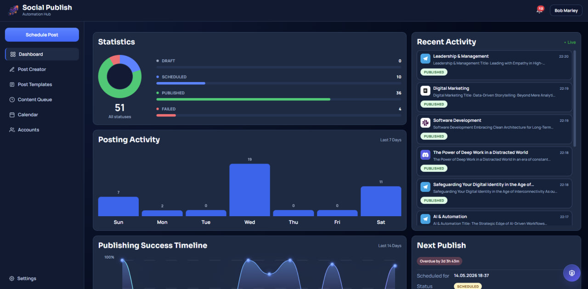
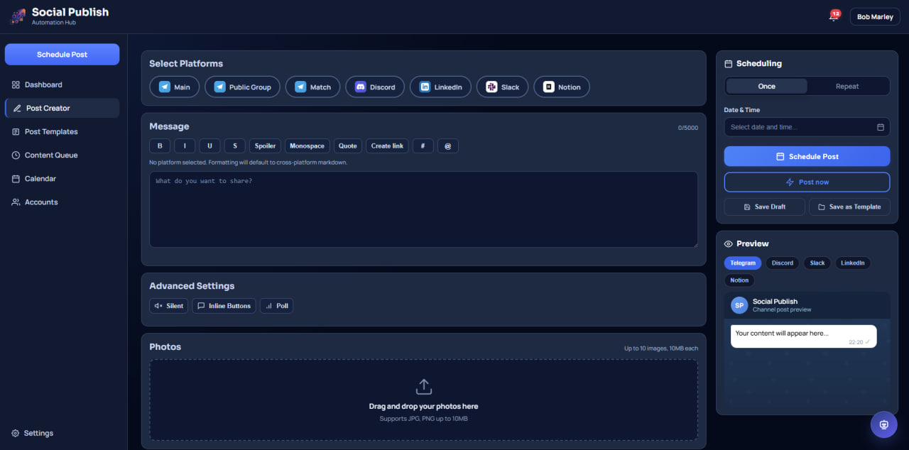
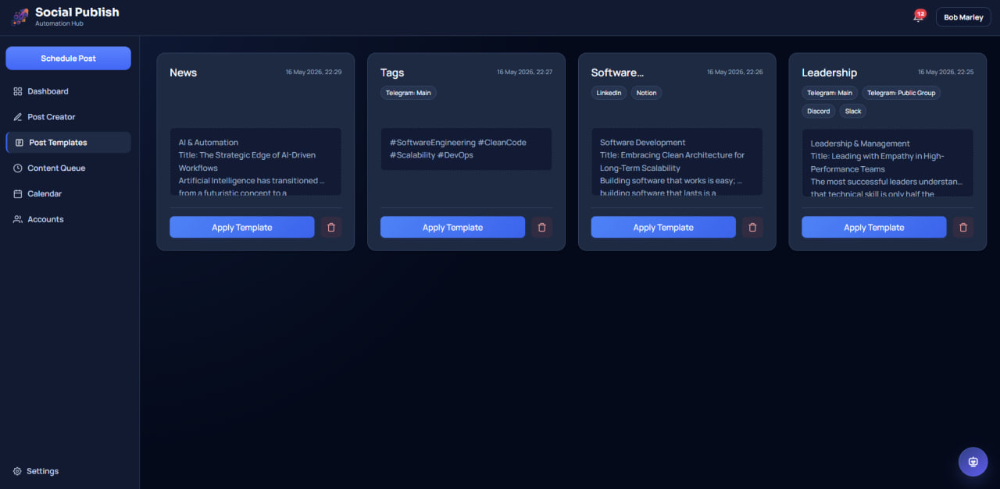
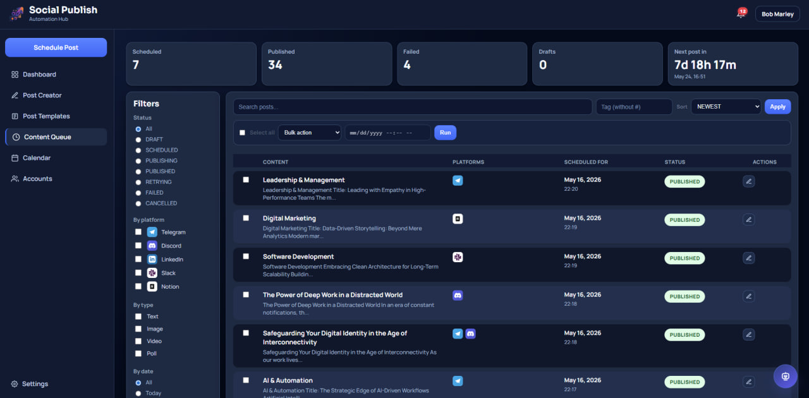
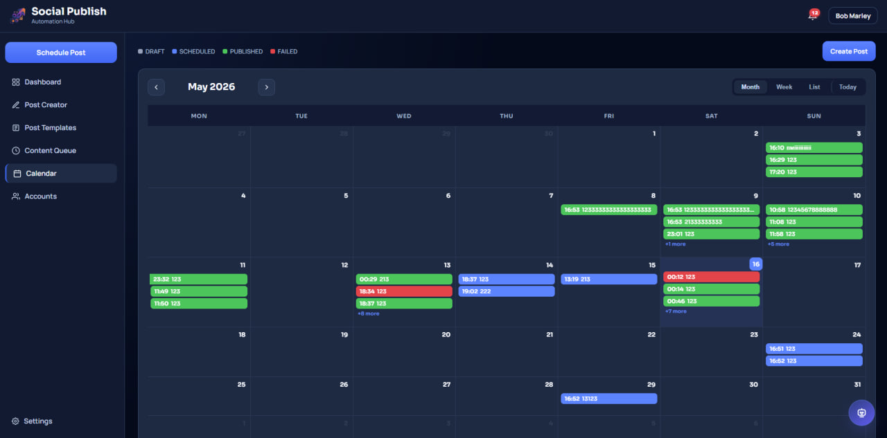
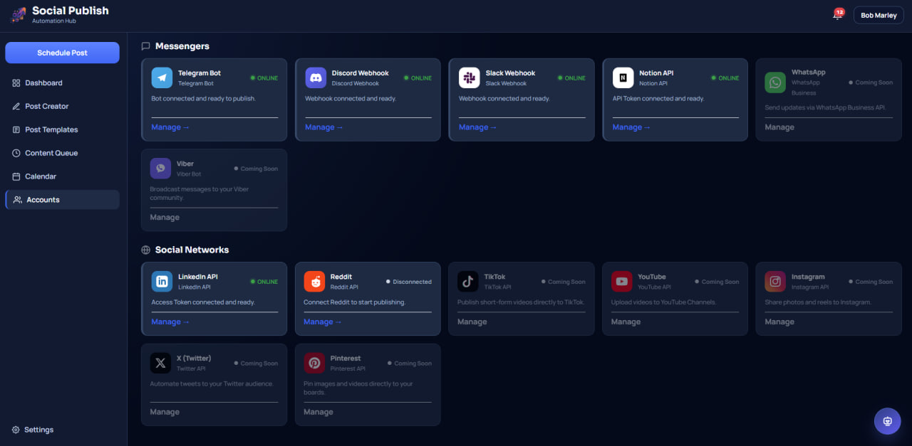
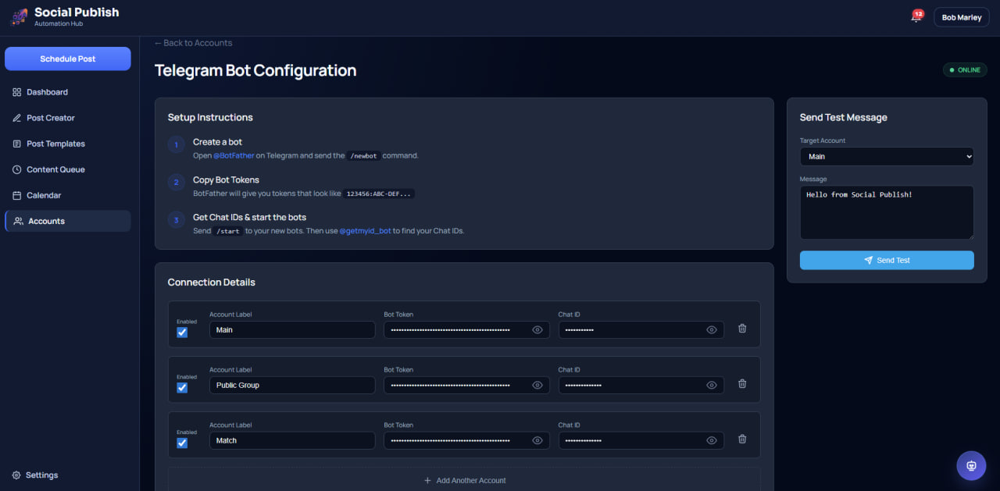
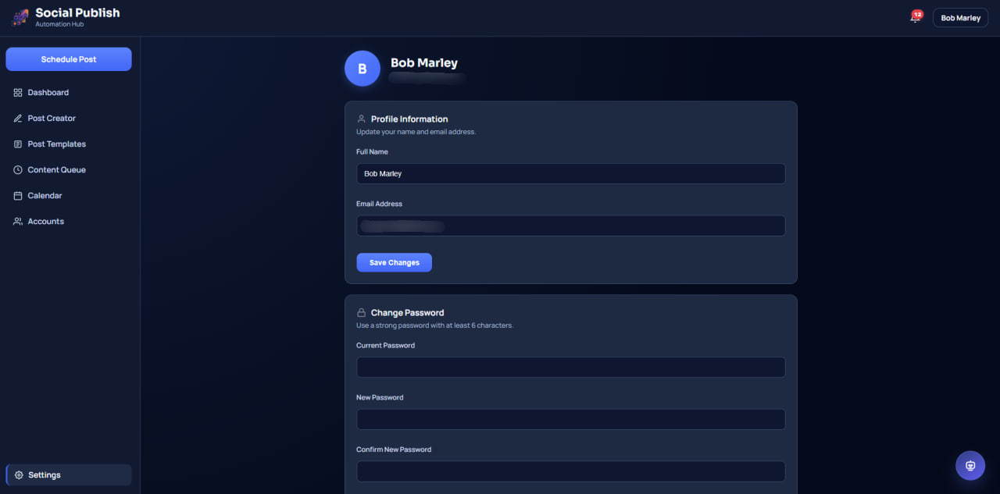

# Social Publish — Multi-Platform Social Media Management Automation

[](docs/screenshots/dashboard.jpg)
[](docs/ARCHITECTURE.md)
[](docs/API_SURFACE.md)
[](LICENSE)

[](https://openjdk.org/projects/jdk/21/)
[](https://spring.io/projects/spring-boot)
[](https://www.postgresql.org/)
[](https://redis.io/)
[](https://www.rabbitmq.com/)
[](https://www.quartz-scheduler.org/)

[](https://www.thymeleaf.org/)
[](https://docs.spring.io/spring-framework/reference/web/websocket.html)
[](https://groq.com/)
[](https://cloudinary.com/)
[](https://www.docker.com/)
[](https://testcontainers.com/)

[](https://core.telegram.org/bots/api)
[](https://discord.com/developers/docs/resources/webhook)
[](https://api.slack.com/)
[](https://developer.linkedin.com/)
[](https://developers.notion.com/)
[](https://www.reddit.com/dev/api/)

---

## Overview

**Social Publish** is an enterprise-grade multi-platform social media management and automation SaaS platform. It allows users to create, preview, schedule, and publish content across **6 major social platforms** (Telegram, Discord, Slack, LinkedIn, Notion, Reddit) simultaneously from a unified web interface. 

The platform combines an asynchronous event-driven publishing pipeline, persistent clustered job scheduling, high-throughput Redis caching, an integrated **Groq LLaMA 3.3 70B** AI assistant, real-time WebSocket notifications, and multi-channel media management powered by Cloudinary.

<p align="center">
  
</p>

---

## Tech Stack

### Backend — `src/main/java/com/socialpublish/`
- **Java 21** with **Spring Boot 4.0.6** (Spring Framework 7.x)
- **Spring Security & Google OAuth2 SSO**: Hybrid auth supporting Google Social Login and BCrypt-hashed local credentials.
- **Spring Data JPA & Hibernate**: Relational persistence with PostgreSQL 17, optimized queries, and transaction management.
- **PostgreSQL 17**: Core relational data storage and Quartz JDBC job store schema.
- **Redis 7 & Spring Session Redis**: Distributed HTTP session clustering and multi-level data caching (dashboard stats, integration statuses, account labels).
- **RabbitMQ 3 (AMQP)**: Asynchronous event-driven publishing queue with retry backoff, exponential delay routing, and failure isolation.
- **Quartz Scheduler (JDBC Job Store)**: Clustered, restart-resilient cron and one-time post scheduling backed by PostgreSQL.
- **Groq API & LLaMA 3.3 70B Versatile**: Ultra-fast AI conversational assistant for post drafting, tone adaptation, translation, and hashtag extraction.
- **Spring WebSockets & STOMP over SockJS**: Real-time push notifications for instant publishing feedback and background task updates.
- **Spring Mail & Thymeleaf Mailers**: Automated HTML email notifications for critical publishing results and weekly summaries.
- **Cloudinary SDK**: Media processing pipeline for universal photo and video uploads with automatic optimization and CDN delivery.
- **MapStruct 1.6.3**: Compile-time type-safe DTO and Entity transformations.
- **Testcontainers & JUnit 5**: Hermetic PostgreSQL container testing and comprehensive integration test suite.

### Frontend & UI — `src/main/resources/`
- **Thymeleaf 3 Server-Side Rendering (SSR)**: Dynamic server-rendered web UI with modular layouts and reusable UI fragments.
- **Modern Modular JavaScript (ES6+)**: Feature-isolated client controllers (`ai-assistant`, `draft-store`, `calendar`, `accounts`, `landing`).
- **CSS3 Design System & Theme Engine**: Native Dark/Light mode switching, responsive custom properties, and toast system.
- **FullCalendar Integration**: Interactive drag-and-drop editorial calendar for visual scheduling and immediate rescheduling.
- **Pixel-Accurate Live Previews**: Real-time multi-platform post simulators mimicking native platform interfaces (Telegram bubbles, Discord embeds, Slack blocks, LinkedIn cards, Notion pages, Reddit posts).
- **LocalStorage Draft Autosave**: Persistent local client draft recovery preventing data loss across navigation or tab closing.
- **STOMP / SockJS Client**: Real-time toast notifications, badge counters, and live post queue status sync.

### Containerization & Deployment
- **Docker Multi-Stage Build**: Optimized Eclipse Temurin 21 Alpine runtime image.
- **Docker Compose Orchestration**: Unified multi-container stack (`app`, `postgres`, `redis`, `rabbitmq`) with integrated health checks and volume persistence.

---

## Core Features

- **Multi-Platform Post Composer**: Create a single post targeting multiple networks (Telegram, Discord, Slack, LinkedIn, Notion, Reddit) with platform-specific options in a unified flow.
- **AI Content Assistant & Refiner**: Built-in Groq-powered chatbot (LLaMA 3.3 70B) for writing posts from scratch, tone adaptation (*Professional, Casual, Viral, Educational*), language translation, and hashtag extraction.
- **Pixel-Accurate Live Previews**: Realistic adaptive post rendering for each platform (Telegram chat bubble, Discord embed card, Slack block kit, LinkedIn feed post, Notion database page, Reddit submission).
- **Intelligent Scheduling & Interactive Calendar**: One-time and recurring (*daily, weekly, monthly*) scheduling with FullCalendar drag-and-drop rescheduling backed by persistent Quartz JDBC clustering.
- **Asynchronous Queue & Failure Recovery**: RabbitMQ message pipeline decoupling user actions from social API latency, equipped with automatic 3x retries and grace-period tracking.
- **Unified Integrations Hub**: Multi-account support for Telegram, Discord, Slack, and Notion; full OAuth2 authorization code flows for LinkedIn and Reddit with test-send verification.
- **Real-Time & Email Notifications**: STOMP WebSocket toast notifications for instant status feedback plus SMTP HTML email alerts on publishing outcomes.
- **Dashboard & Performance Analytics**: 14-day publishing success/failure trendlines, platform share distribution, queue status counters, and recent activity monitoring with Redis caching.
- **Reusable Post Templates**: Save frequent messaging patterns, formatting rules, and hashtags with one-click composer loading.
- **Media Upload & Optimization**: Cloudinary CDN pipeline for photos and videos with drag-and-drop reordering (up to 10 MB per file, 50 MB total).
- **Dual Authentication & Security**: Google OAuth2 social login, traditional email/password registration, password management, and user preferences.

---

## System Architecture & Patterns

The platform follows an asynchronous, event-driven monolith pattern decoupling user interactions from external API network latencies:

- **Asynchronous Event Pipeline**: Instant queue dispatching via RabbitMQ with worker pool consumers and automatic retry logic.
- **Quartz JDBC Clustering**: Persistent database-backed task store surviving container restarts with multi-node safety.
- **Clustered Session & Redis Caching**: Seamless horizontal scaling with session storage and sub-millisecond query cache layers.
- **Modular Platform Adapters**: Strict domain boundaries for Telegram, Discord, Slack, LinkedIn, Notion, and Reddit integrations.

Detailed architecture diagrams, sequence workflows, and design decisions: **[docs/ARCHITECTURE.md](docs/ARCHITECTURE.md)**

---

## Screenshots

| Dashboard | Post Creator |
| :---: | :---: |
|  |  |

| Post Templates | Content Queue |
| :---: | :---: |
|  |  |

| Content Calendar | Account Management |
| :---: | :---: |
|  |  |

| Platform Configuration | User Settings |
| :---: | :---: |
|  |  |

---

## UI Routes & API Surface

Social Publish provides a full suite of server-rendered Thymeleaf pages and JSON REST APIs for scheduling, template management, Groq AI completions, and WebSocket notifications.

Complete UI routes catalog and REST API endpoint specification: **[docs/API_SURFACE.md](docs/API_SURFACE.md)**

---

## Testing & Quality

The platform includes a comprehensive automated test suite covering unit logic, state machines, DTO mappings, and full service integration flows:

- **Unit Tests**: Verification of isolated business logic, DTO mapping, and post status state machine transitions using **JUnit 5** and **Mockito**.
- **Integration Tests**: End-to-end verification of service flows, authentication resolution, asynchronous event dispatching, and persistence layers.
- **Hermetic In-Memory Testing**: By default, tests execute against an in-memory H2 database under the `test` profile for rapid feedback without external service dependencies.
- **PostgreSQL Testcontainers**: Support for true containerized PostgreSQL test runs matching production database behavior.

To run the test suite locally:

```bash
./mvnw clean test
```

---

## Repository Structure

```
social-publish/
├── .mvn/                            # Maven wrapper configuration
├── docs/
│   ├── ARCHITECTURE.md              # Detailed architecture, sequence diagrams & patterns
│   ├── API_SURFACE.md               # UI routes catalog & REST/WebSocket API specification
│   └── screenshots/                 # Application screenshots & UI previews
├── src/
│   ├── main/
│   │   ├── java/com/socialpublish/
│   │   │   ├── aiassistant/         # Groq AI Assistant (LLaMA 3.3 70B client & prompt builder)
│   │   │   ├── auth/                # Security, OAuth2 user sync, login, registration, settings
│   │   │   ├── common/              # Global configs, Redis cache, exception handling, validators
│   │   │   ├── dashboard/           # Analytics, statistics builders, timeline views
│   │   │   ├── integrations/        # Multi-platform adapters (Telegram, Discord, Slack, etc.)
│   │   │   ├── mail/                # SMTP email delivery & HTML templates
│   │   │   ├── media/               # Media upload handler & Cloudinary SDK integration
│   │   │   ├── notifications/       # WebSocket STOMP notification dispatching
│   │   │   ├── posts/               # Post management, editor, templates, status state machine
│   │   │   ├── publishing/          # RabbitMQ message listeners & platform publishers
│   │   │   └── scheduling/          # Quartz JDBC job store & scheduled post triggers
│   │   └── resources/
│   │       ├── static/              # CSS stylesheets, modular JavaScript files, assets
│   │       ├── templates/           # Thymeleaf HTML views & layout fragments
│   │       ├── application.properties
│   │       └── application-security.properties
│   └── test/                        # JUnit 5 & Testcontainers integration tests
├── Dockerfile                       # Multi-stage production Java 21 container build
├── compose.yaml                     # Multi-container stack (App, PostgreSQL, Redis, RabbitMQ)
├── pom.xml                          # Maven project definition & dependencies
└── README.md
```

---

## Running Locally

### Prerequisites
- **Docker & Docker Compose** (Recommended)
- *OR* Java 21+, Maven 3.9+, PostgreSQL 17+, Redis 7+, RabbitMQ 3+

---

### Option 1: Hybrid Development (Recommended)

Run infrastructure dependencies in Docker and execute the Spring Boot application locally with live reload:

```bash
# 1. Start infrastructure services
docker compose -f compose.yaml up -d postgres redis rabbitmq

# 2. Configure local secrets (if needed)
# Edit src/main/resources/application-security.properties or pass via environment

# 3. Start the application
./mvnw spring-boot:run
```

---

### Option 2: Full Docker Stack

Run the entire application along with all dependencies in isolated containers:

```bash
# 1. Clone the repository
git clone https://github.com/polchduikt/social-publish.git
cd social-publish

# 2. Start all services
docker compose -f compose.yaml up -d --build
```

---

### Available Local Endpoints:
- **Application Web UI**: [http://localhost:8080](http://localhost:8080)
- **RabbitMQ Management Console**: [http://localhost:15672](http://localhost:15672) *(guest / guest)*
- **PostgreSQL Database**: `localhost:5432` *(db: socialpublish, user: postgres, pass: admin)*
- **Redis Cache & Sessions**: `localhost:6379`

---

## Documentation Index

All architectural choices, setup guides, and project specifications are documented in the `docs/` directory:

- [docs/ARCHITECTURE.md](docs/ARCHITECTURE.md) — Detailed backend architecture, sequence diagrams & design decisions.
- [docs/API_SURFACE.md](docs/API_SURFACE.md) — Complete UI route catalog, REST API endpoints & WebSocket topics.

---

## Status

Social Publish is actively maintained, continuously tested, and regularly updated with new social platform integrations and automation features.

---

## License

This project is licensed under the [MIT License](LICENSE).
