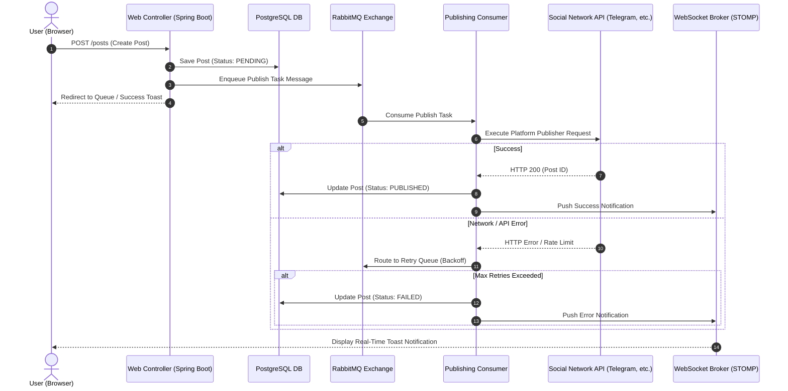

# Social Publish — System Architecture & Design Decisions

This document details the architectural design, component interactions, asynchronous processing models, and data flows within the **Social Publish** platform.

---

## 1. High-Level Architecture Overview

Social Publish follows a modular, feature-oriented monolithic architecture built on **Spring Boot 4.0.6** and **Java 21**, designed for high throughput, asynchronous task execution, and resilient social media publishing.

```
┌────────────────────────────────────────────────────────────────────────────────────────┐
│                                     Browser (Client)                                   │
│              Thymeleaf SSR + Modular JS + FullCalendar + STOMP / SockJS                │
└───────────────────────────────────────────┬────────────────────────────────────────────┘
                                            │ HTTP / WebSocket (SockJS)
┌───────────────────────────────────────────▼────────────────────────────────────────────┐
│                               Spring Boot Application                                  │
│                                                                                        │
│  ┌──────────────────┐  ┌──────────────────┐  ┌──────────────────┐  ┌────────────────┐  │
│  │   Auth Module    │  │   Posts & Drafts │  │  Quartz Engine   │  │  Integrations  │  │
│  │ (OAuth2 / Local) │  │  (Composer/Tmpl) │  │ (JDBC Job Store) │  │ (6 Platforms)  │  │
│  └──────────────────┘  └──────────────────┘  └──────────────────┘  └────────────────┘  │
│  ┌──────────────────┐  ┌──────────────────┐  ┌──────────────────┐  ┌────────────────┐  │
│  │  Dashboard & Bi  │  │   AI Assistant   │  │  Notifications   │  │   Publishing   │  │
│  │ (Stats / Cache)  │  │  (Groq / LLaMA)  │  │   (WS + Mail)    │  │ (RabbitMQ AMQP)│  │
│  └──────────────────┘  └──────────────────┘  └──────────────────┘  └────────────────┘  │
└───────┬──────────────────────┬──────────────────────┬──────────────────────┬───────────┘
        │                      │                      │                      │
   ┌────▼────────┐       ┌─────▼───────┐        ┌─────▼───────┐        ┌─────▼───────┐
   │ PostgreSQL  │       │   Redis 7   │        │ RabbitMQ 3  │        │ Cloudinary  │
   │ (DB+Quartz) │       │(Cache+Sess) │        │(Async Queue)│        │ (Media CDN) │
   └─────────────┘       └─────────────┘        └─────────────┘        └─────────────┘
```

---

## 2. Core Architectural Pillars

### 2.1 Asynchronous Event-Driven Publishing (RabbitMQ)
- **Decoupled Workflows**: User actions (e.g. clicking "Publish Now" or triggered by Quartz) do not make synchronous HTTP requests to social platform APIs inside the web request lifecycle.
- **Message Serialization**: A lightweight publish task payload containing target accounts, post ID, media URLs, and content is published to a dedicated RabbitMQ exchange.
- **Worker Isolation & Resilient Retries**:
  - Worker consumers read tasks from the queue and invoke platform-specific publisher adapters.
  - Automatic retry mechanism (up to 3 retries) with exponential delay routing for transient network failures.
  - Failures on one platform (e.g., Reddit rate limit) do not block or fail publishing on other platforms (e.g., Telegram, Discord).

### 2.2 Persistent Job Scheduling (Quartz JDBC Store)
- **Cluster & Restart Resilient**: Scheduled posts are not kept in volatile memory. All jobs, triggers, and calendar schedules are persisted directly into PostgreSQL tables using the `PostgreSQLDelegate`.
- **Zero-Loss Guarantee**: If the application server restarts or scales horizontally, missed triggers or upcoming jobs are automatically picked up by available nodes without duplicate executions.
- **FullCalendar Synchronization**: Drag-and-drop actions in the UI calendar instantly recalculate cron/one-time Quartz triggers via `/api/calendar/events/{id}/reschedule`.

### 2.3 Multi-Layer Caching & Clustered Sessions (Redis)
- **Distributed Session Clustering**: HTTP user sessions are managed through `spring-session-data-redis`, enabling stateless application nodes and zero-downtime rolling deployments.
- **High-Performance Read Caching**:
  - Dashboard analytics, 14-day timeline aggregations, and account status counters are cached in Redis with a 10-minute TTL.
  - Fine-grained cache eviction occurs whenever a post status transitions (`DRAFT` -> `SCHEDULED` -> `PUBLISHED` / `FAILED`) or an integration is modified.

### 2.4 Modular Multi-Platform Adapters (`com.socialpublish.integrations.*`)
Each platform is encapsulated in its own package with a clean separation of concerns:
- **Telegram**: Telegram Bot API integration supporting message text, image/video albums, inline buttons, polls, and silent delivery options.
- **Discord**: Webhook-based integration with rich embeds, custom author fields, footer branding, and color coding.
- **Slack**: Webhook and Block Kit builder supporting structured layout formatting and interactive links.
- **LinkedIn**: OAuth2 Authorization Code flow, access token refresh, and UGC Share API integration.
- **Notion**: Internal integration token authentication, database child page creation, and multi-property mapping.
- **Reddit**: OAuth2 Authorization Code flow, link/self-post submission, and subreddit selection.

### 2.5 AI Assistant Pipeline (Groq LLaMA 3.3 70B)
- **Ultra-Fast LLM Inference**: Direct integration with Groq Cloud API for sub-second text completions.
- **Contextual Prompt Engineering**: Context builder structures prompts based on selected social platforms, requested tone (*Professional, Casual, Viral, Educational, Minimalist*), and target language.
- **Response Parsing**: Structured parser cleans output, strips markdown artifacts, and isolates generated hashtags.

### 2.6 Real-Time Communication & Notifications
- **STOMP over SockJS**: Real-time bidirectional WebSocket channel delivers instant UI toasts when background publishing tasks succeed or fail.
- **SMTP HTML Email Dispatch**: Critical alerts and weekly performance summaries are rendered via Thymeleaf email templates and sent asynchronously.

### 2.7 Media Management & CDN (Cloudinary)
- Direct multi-part upload handling with validation on file type, size (up to 10MB per file, 50MB per post), and ordering.
- Delivery optimization through Cloudinary CDN ensures fast loading across social networks and internal preview cards.

---

## 3. Data Flow Diagrams

### 3.1 Post Creation & Publishing Flow



---

## 4. Security Architecture

- **Authentication Providers**:
  - **Form Login**: BCrypt password hashing with strict validation.
  - **Google OAuth2 SSO**: Automatic user profile synchronization via `OAuth2UserSyncService`.
- **Platform OAuth2 Tokens**: LinkedIn and Reddit access tokens and refresh tokens are securely stored and refreshed transparently.
- **Stateless Argument Resolution**: `@CurrentUser` custom annotation automatically resolves authenticated user context into controller handler methods.
